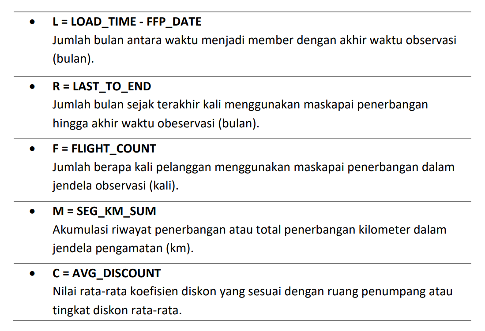
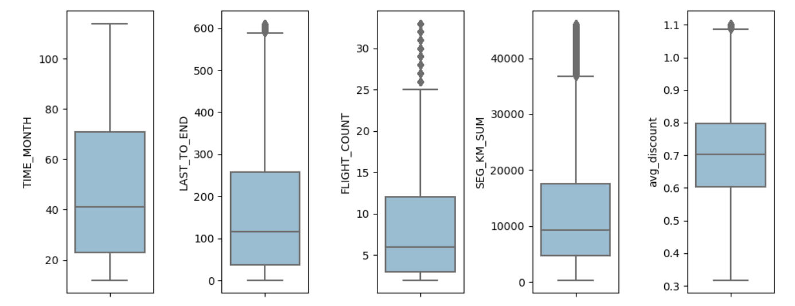
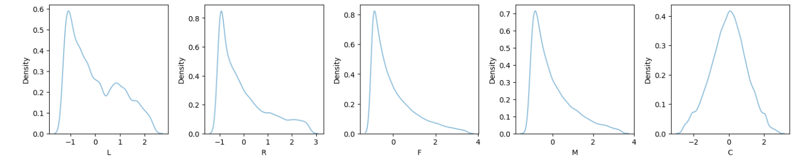
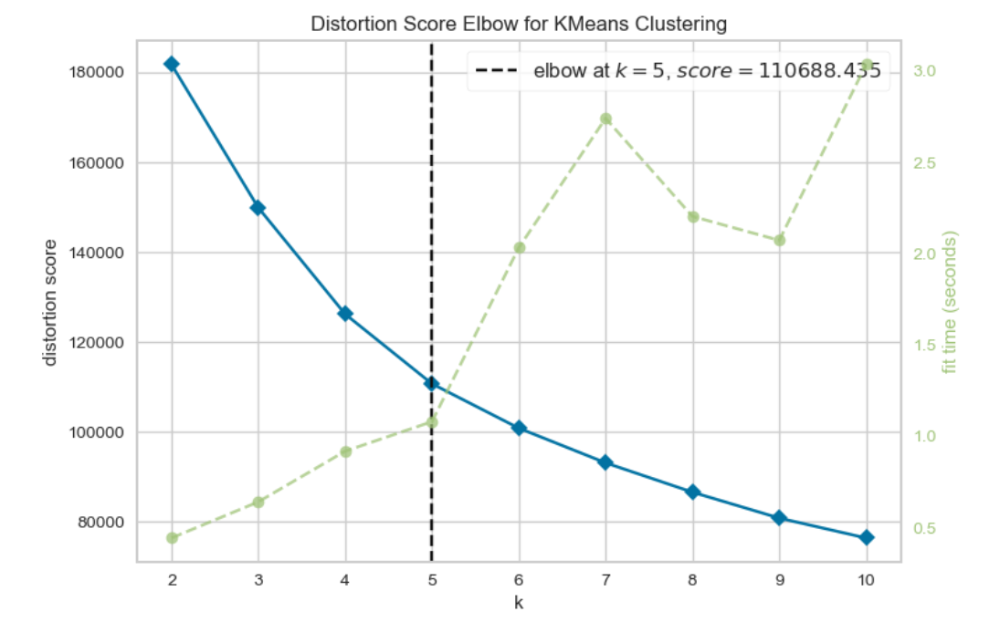
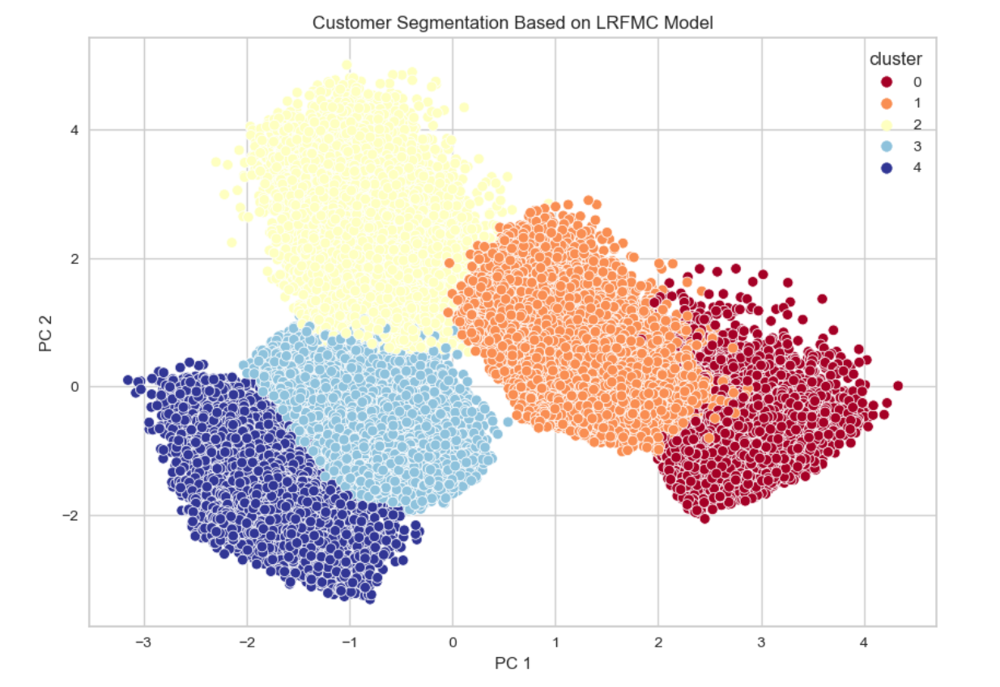
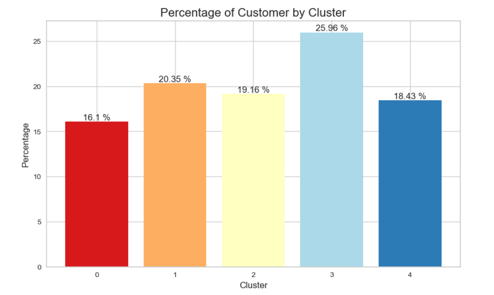
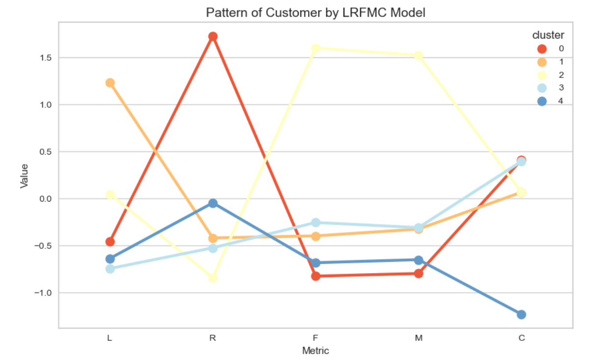
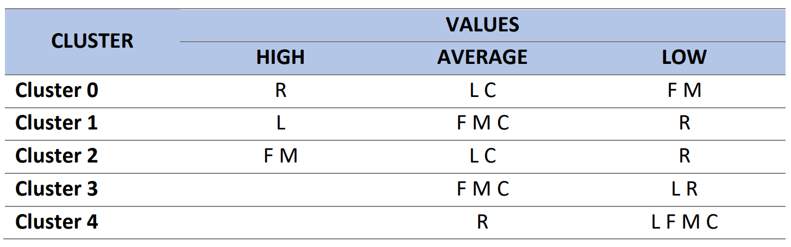

# **Airline Customer Segmentation Based on LRFMC Model Using K-Means**
- Tools : Python 
- Dataset : Rakamin Academy  
- Notebook : [View](https://github.com/faizns/Airline-Customer-Segmentation-LRFMC-Model-using-KMeans/blob/4655776d6d4c07363ad286a7bc065a85f3b7a55f/Airline-Customer-Segmentation-LRFMC-Model-using-KMeans.ipynb)
 

---

## 📂 **Introduction**
### Problem Statement
- Seiring dengan perutumbuhan jaringan maskapi penerbangan, menjadikan persaingan antar perusahaan maskapai penerbangan semakin ketat dan meningkat. Permasalahan yang sering terjadi dalam peruhaaan ini diantaranya adalah **kehilangan pelanggan** serta **penurunan daya saing**. 
- Dengan datangnya era informasi, fokus marketing perusahaan telah beralih dari *product-based* menjadi ke ***customer-based***. Salah satu pendekatan yang dapat dilakukan adalah dengan **pengklasifikasian atau segmentasi pelanggan**, yang memungkinkan maskapai penerbangan untuk membedakan antara pelanggan bernilai tinggi serta pelanggan bernilai rendah dan untuk menyediakan **layanan yang dipersonalisasi** dan **strategi marketing** untuk setiap kelompok. Tujuannya adalah untuk **memaksimalkan keuntungan** dengan memfokuskan sumber daya pada pelanggan yang bernilai untuk perusahaan.

### Objectives
1. Melakukan **segmentasi** pelanggan menggunakan data pelanggan maskapai penerbangan berdasarkan LRFMC Model menggunakan K-Means.
2. Analisis **karakteristik** setiap kelompok/cluster yang dihasilkan dari segmentasi.
3. Memberikan **insight bisnis** terkait hasil analisis.  
 

---

## 📂 **Exploratory Data Analysis**
### Dataset
- Dataset memiliki 62988 baris dan 23 fitur (**15 numerikal, 8 kategorikal**).
- Terdapat **7.51 % missing values** (WORK_PROVINCE, WORK_CITY, SUM_YR_1, AGE, SUM_YR_2, WORK_COUNTRY).
- **Tidak** terdapat data yang **duplikat**.

### Summary
- Mayoritas fitur **positively-skewed** dengan mean > median.
- Terdapat **outlier** pada semua fitur numerikal.
- Terdapat **nilai 0** pada fitur EXCHANGE_COUNT, avg_discount, Points_Sum, Point_NotFlight, SUM_YR_1, SUM_YR_2,  AVG_INTERVAL, dan MAX_INTERVAL.
- Sebanyak **77%** pelanggan maskapai adalah **laki-laki**.
- Mayoritas, **92%** pelanggan maskapai berasal dari **Negara China**.
- Sebanyak **29%** pelanggan maskapai berasal dari **provinsi Guangdong** dan **15%** yang berasal dari **kota guangzhou**. 
 

---

## 📂 **Pre-processing**
### Handling Missing Values
- Berdasarkan observasi yang telah dilakukan, terdapat nilai anomali yaitu 0 pada harga tiket (SUM_YR_1, SUM_YR_2), avg_discount, dan total jarak tempuh (SEG_KM_SUM) bernilai lebih besar dari 0. **Data dengan harga tiket kosong atau 0 dapat disebabkan karena pelanggan tidak memiliki riwayat perjalanan penerbangan**. Data-data tersebut dilakukan penghapusan.
- Menghapus fitur-fitur yang **tidak relavan, berdampak sangat kecil, dan redundan** seperti MEMBER_NO, WORK_CITY, WORK_PROVINCE, WORK_COUNTRY, AGE, GENDER.
- Dikarenakan setelah langkah tersebut missing values menjadi 1.1%, maka sisa data yang memiliki missing values dilakukan penghapusan.

### Feature Selection
- LRFMC adalah sebuah metode yang dapat digunakan untuk melakukan segmentasi pelanggan maskapai penerbangan. **L** adalah singkatan dari **loyalitas**, **R** untuk **recency**, **F** untuk **frekuensi**, **M** untuk nilai **moneter**, dan **C** untuk **kategori(diskon)**. Kelima faktor ini dapat digunakan untuk menyegmentasikan pelanggan berdasarkan seberapa loyal mereka terhadap maskapai penerbangan, seberapa sering mereka melakukan perjalanan, seberapa sering mereka melakukan perjalanan, berapa banyak yang mereka habiskan untuk tiket pesawat, dan seberapa pelanggan menggunakan diskon.
- Berdasarkan model LRFMC, enam fitur yang terkait dengan indeks model LRFMC dipilih: **FFP_DATE, LOAD_TIM, FLIGHT_COUNT, AVG_DISCOUNT, SEG_KM_SUM, LAST_TO_END**.
- Metode perhitungan spesifiknya adalah sebagai berikut:

   Tabel 1 – Perhitungan Fitur berdasarkan LRFMC   
   <kbd> </kbd>

### Handling Outlier
- Handling outlier dilakukan dengan menggunalan metode **IQR**.

   <kbd> </kbd>  
   Gambar 1 – Distribusi fitur-fitur LRFMC Setelah Melakukan Menghilangkan Outlier    

### Feature Standardization
- Standardization menggunakan **StandardScaler**.

   <kbd> </kbd>  
   Gambar 3 – Distribusi fitur-fitur LRFMC Setelah Melakukan Standardization  

 

---

## 📂 **Modeling**

### Finding K Optimal
Algoritma K-Means adalah metode clustering yang didasarkan pada **centroid** (pusat pengelompokan). Masukan jumlah clustering K dan database yang berisi N objek data, dan keluaran K-cluster yang memenuhi standar minimum *error sum of squares*.  

Untuk menentukan jumlah cluster yang optimal dalam dataset, maka dilakukan analisis K-cluster menggunakan **Elbow Method** dan **Silhouette Plot**.

   <kbd> </kbd>  
   Gambar 4 – Grafik Elbow Method dengan Distortion Score  

Berdarkan hasil dari grafik **Elbow Method** menunjukkan tidak terlalu terlihat patahan yang tajam dan penurunaan nilai inertia yang signifikan. Namun pada garis **distortion score** menunjukkan bahwa K optimal berada di angka **5**.

   <kbd> </kbd>  
   Gambar 5 – Grafik Silhouette Plot 

Berdarkan hasil **Silhouette Plot** menunjukkan K omptimal **5**. Untuk menentukan nilai K optimal pada **Silhouette Plot** dapat mempertimbangkan dua faktor yaitu koefisien rata-rata sebesar mungkin, namun tetap lebih kecil dari skor maksimum setiap anggota cluster, dan mempertimbangkan ketebalan cluster yang mirip satu sama lain. Ketebalan cluster ini yang menunjukkan komposisi yang seimbang. 

### Result
Setelah menemukan K optimal dilakukan *fit model K-Means* dengan **n_clusters=5** dan dilakukan **dimensionality reduction** menggunakan **PCA**. Hasil cluster yang terbentuk dapat dilihat dari grafik berikut ini :

   <kbd> </kbd>  
   Gambar 5 – Clustering of Customer Segmentation  

 

---

## 📂 **Interpretation**
### Precentage of Customer

   <kbd> </kbd>  
   Gambar 6 – Persentase Total Pelanggan Setiap Cluster  

Dari hasil grafik dapat dilihat bahwa persentase jumlah pelanggan **tertinggi** berada pada **cluster 3** yaitu sebesar **25.96%** dan **terendah** pada **cluster 0** sebesar **16.10%**.

### Analysis Characteristic of Cluster Based on LRFMC

   <kbd> </kbd>  
   Gambar 7 – Pola dan Karakteristik Cluster berdasarkan LRFMC  

   Tabel 2 – Evaluasi dan Analisis Fitur Cluster  
   <kbd> </kbd>

**Interpretasi :**  
1. Cluster 0 - **Hibernating**
    - Kelompok customer yang telah menjadi member dalam jangka waktu menengah namun tidak sering menggunakan maskapai, nilai frequency dan monetery yang rendah serta recency yang tinggi. 
     
    
2. Cluster 1 - **Loyal Customers**
    - Kelompok customer yang telah menjadi member dalam jangka waktu paling lama dan memiliki aktivitas penerbangan sedang, rentang waktu untuk melakukan penerbangan tidak terlalu jauh dan cukup sering menggunakan maskapai. 
     

3. Cluster 2 - **Potential Loyalist - The Campions**
    - Kelompok customer yang memliki aktivitas penerbangan yang sangat tinggi, sering menggunakan maskapai dan dengan jarak yang jauh sehingga sangat berpotensi untuk menghasilkan revenue. Kelompok ini juga memiliki tingkat recency yang rendah, artinya rentang waktu untuk melakukan setiap penerbangan tidak terlalu jauh atau. Selain itu customer telah memjadi member sudah cukup lama.  
     
    
4. Cluster 3 - **Recent User**
    - Kelompok new customer yang baru-baru ini menggunakan maskapai. Hal tersebut dapat dilihat dari waktu bergabung menjadi member belum lama dan memiliki tingkat recency yang rendah, selain itu aktivitas sering tidaknya menggunakan maskapai dan jarak tempuhnya sedang.  
     
    
5. Cluster 4 - **Need Attention**
    - Kelompok new customer yang memiliki aktivitas dan penggunaan maskapai yang rendah. Kelompok ini juga memiliki tingkat diskon yang didapatkan rendah. 
     
    
---

## 📂 **Business Recomendation**
1. Cluster 0 - **Hibernating**
    - Customer yang sudah ada, namun belum menggunakan maskapai baru-baru ini. Dibuttuhkan perlakuan agar customer melakukan pembelian sesegera mungkin, atau perusahaan akan kehilangan kepercayaan dari customer.
    - **Rekomendasi Bisnis :**
         - Mengirimkan email marketing kepada customer di kelompok ini dengan program "We Miss You" dan memberikan spesial voucher atau kode diskon untuk digunakan pada penerbangan yang yang akan datang dengan batas waktu berlaku yang telah ditentukan sebelumnya. 
 

2. Cluster 1 - **Loyal Customer**
    - Kelompok customer yang telah lama menggunakan maskapai. Customer senang dengan layanan yang disediakan dan tidak beralih ke alternatif lain. Penting untuk memberikan perlakuan agar pelanggan merasa dihargai.
    - **Rekomendasi Bisnis :**
         - Mengirimkan email terimakasih "Terimakasih telah Terbang Bersama Kami" dan memberikan kode voucher/diskon untuk penerbangan berikutnya.
         - Memberikan point/reward untuk setiap pemesanan maskapai yang dapat direedem dengan voucher diskon atau produk afiliasi dengan maskapai. 
 

3. Cluster 2 - **Potential Loyalist - The Campions**
    - Sering menggunakan maskapai dan dengan jarak yang jauh. Dapat menjadi kontributor yang signifikan untuk revenue perusahaan. Customer pada kelompok ini harus diperlakukan dengan baik dan hati hati, serta perlu untuk menjadikan customer merasa dihargai agar menjadi loyalis perusahaan.
     - **Rekomendasi Bisnis :**
         - Membangun hubungan baik dengan customer melalui on boarding support seperti dengan menyediakan Flight Booking Assitant.
         - Memberikan souvenir atau merchandise.
         - Memberikan potongan harga untuk pembelian lebih dari satu penerbangan dalam sekali waktu.
         - Memberikan potongan harga/reward spesial apabila terbang dengan mengajak teman.
         - Memberikan point/reward untuk setiap pemesanan maskapai. 
 

4. Cluster 3 - **Recent User**
    - Kelompok yang masih baru menggunakan maskapai, perlu diberikan perlakuan untuk menjadi loyalis customer dalam jangka panjang. Perlu untuk dilakukan monitoring secara kontinue untuk mencegah customer pergi setelah beberapa waktu tertakhir.
    - **Rekomendasi Bisnis :**
         - Mengirimkan email terimakasih "Terimakasih telah Terbang Bersama Kami" dan memberikan kode voucher/diskon untuk penerbangan berikutnya.
         - Memberikan point untuk setiap kali penerbangan.
         - Memberikan reward/voucher/diskon setelah mencapai beberapa penerbangan dalam periode tertentu, misalnya 2 penerbangan dalam 1 tahun. 
 

5. Cluster 4 - **Need Attention**
    - Kelompok Customer baru dengan konsumsi sangat rendah, dapat terjadi karena berbagai macam alasan. Dibutuhkan perlakuan yang dipersonalisasikan dengan demografi dan kebiasaan customer.
     - **Rekomendasi Bisnis :**
         - Mengirimkan personalized campaign atau promo.
         - Mengirimkan newsletter untuk memberitahukan diskon dan program penerbangan yang bermanfaat untuk mendorong pelanggan menggunakan maskapai lagi. 
          
----
**Referenfes**  
[1] Tao, Y.: Analysis Method for Customer Value of Aviation Big Data Based on LFRMC Model. ICPCSEE 2020, CCIS 1257. 89-100(2020)  
[2] Wang, P. & Chen, T.: Data Value Mining: A Case Study of Airline Customer Data. IJRES 2022, 05-13(2022)  
[3] https://clevertap.com/blog/rfm-analysis/  
[4] https://www.moengage.com/blog/rfm-analysis-using-rfm-segments/  
